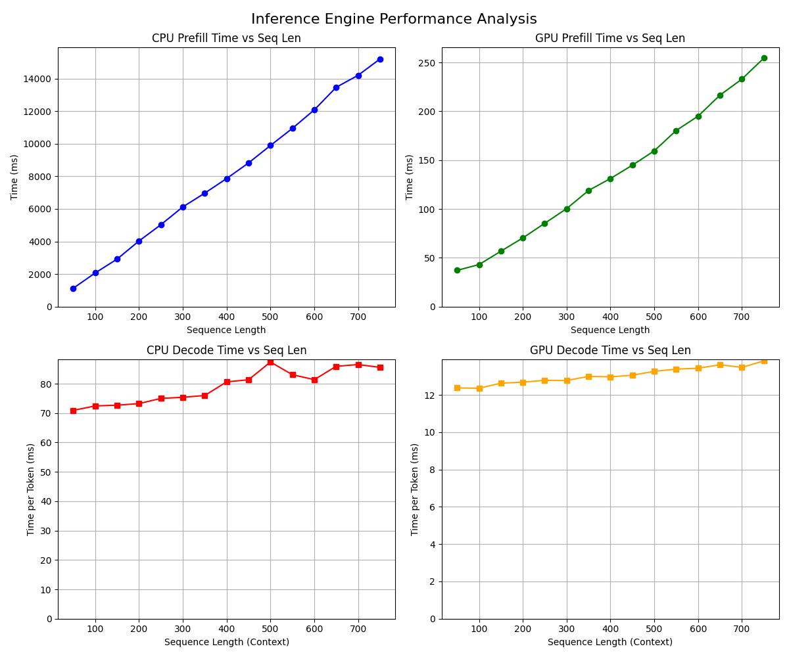

用ai快速生成了一个README
后面会补上完整的blog的 (0v0)




# 0.7B 对话模型推理引擎

一个为自研0.7B对话模型（Transformer解码器）手工打造的 **C++/CUDA 推理引擎**。核心算子全部手写（仅依赖标准库和 CUDA），在 RTX 3060 上达到 **prefill 3000 tokens/s**（750 tokens 约 250 ms）、**decode 80 tokens/s**（每 token 12.5 ms）的性能。测试代码、Python 绑定及 CMake 配置由 vibe coding 生成。

---

## 模型规格
- 16 层 TransformerBlock  
- 隐层维度 1536，24 头注意力（每头 64）  
- SwishGLU 前馈网络（隐层 4096）  
- RoPE 位置编码（底数 10000）  
- 词表大小 151669，输出层共享 Embedding 权重  
- 最大序列长度 768

---

## 实现特点
- **手写算子**：Linear、RMSNorm、RoPE、MultiHeadAttention、Embedding、SwishGLU 均提供 CPU（AVX2/OpenMP）和 CUDA 实现  
- **KV Cache 管理**：prefill 并行填充，decode 增量更新  
- **FlashAttention 风格**：prefill kernel 分块 online softmax，decode kernel 共享内存规约  
- **内存统一**：`Tensor` 类管理 CPU/GPU 数据，禁用拷贝，显式迁移  
- **双后端**：统一接口，设备切换仅需 `to(device)`

---

## 性能摘要（RTX 3060）
| 模式    | 长度       | 耗时             | 吞吐量        |
| ------- | ---------- | ---------------- | ------------- |
| Prefill | 750 tokens | 约 250 ms        | 3000 tokens/s |
| Decode  | 自回归生成 | 每 token 12.5 ms | 80 tokens/s   |

各算子独立测速详情见测试输出。

---

## 构建与依赖
- **编译器**：C++17，CUDA（架构 `native`）  
- **依赖**：CUDA Toolkit、OpenMP、pybind11（自动下载）  
- **编译选项**：  
  - C++ 文件：`-O3 -march=native -fopenmp -ffast-math`  
  - CUDA 文件：`-O3 -Xcompiler=-march=native,-fopenmp,-ffast-math`  
  - 关闭 LTO 与可分离编译  
- **生成 Python 模块**：`llm_cpp_engine`

---

## 快速开始
```python
import llm_cpp_engine
engine = llm_cpp_engine.InferenceEngine('cuda')  # 或 'cpu'
engine.load('path/to/model')
next_token = engine.next_token([input_ids], temperature=0.7)
```

---

## 代码来源
- **手写**：所有核心算子（`ops.h`、`*cu` 文件）、Tensor 管理、推理流程  
- **vibe coding 生成**：单元测试（`test_*.cu`）、Python 绑定（`bindings.cpp`）、CMakeLists.txt

---

